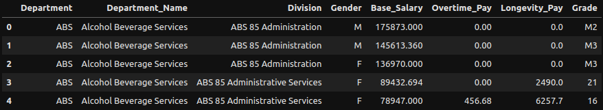
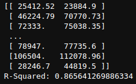
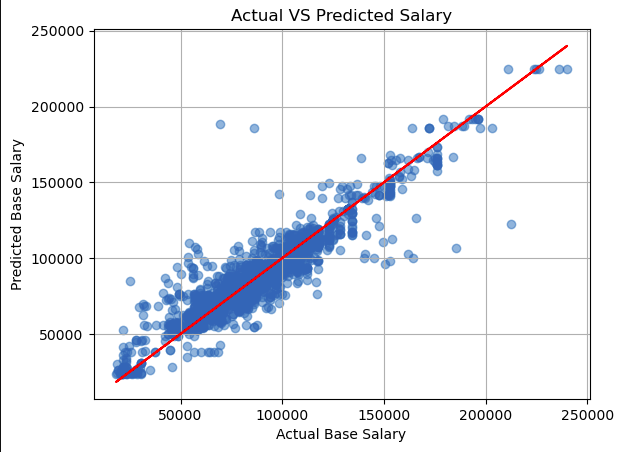

# EmployeeInsights
EmployeeInsights is a data analytics project aimed at providing comprehensive insights into employee salaries. Leveraging machine learning techniques, it predicts the base salary of employees based on various factors including department, division, gender, overtime pay, longevity pay, and grade. By analyzing historical salary data and employee attributes, the system offers valuable insights that assist organizations in making data-driven decisions regarding compensation and workforce management.

## Sample Data

## ML Algorithm Used
RandomForestRegressor is used to predict the base salary of employees. It is an ensemble learning method that builds multiple decision trees during training and outputs the average prediction of the individual trees for regression tasks. It belongs to the ensemble family of algorithms, which combine multiple machine learning models to improve performance and robustness.

## R-Squared Score

## Visualising Actual VS Predicted Salary

## Dataset Source
[https://www.kaggle.com/datasets/sahirmaharajj/employee-salaries-analysis](https://www.kaggle.com/datasets/sahirmaharajj/employee-salaries-analysis)
